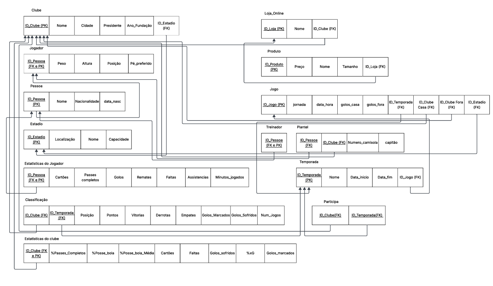

# BD: Trabalho Prático APFE

**Grupo**: P3G12
- Keegan Azevedo, MEC: 110160
- Francisco, MEC: 126255

## Introdução / Introduction
 
Escreva uma pequena introdução sobre o trabalho.
Write a simple introduction about your project.

## ​Análise de Requi\sitos / Requirements

## DER

## ER

