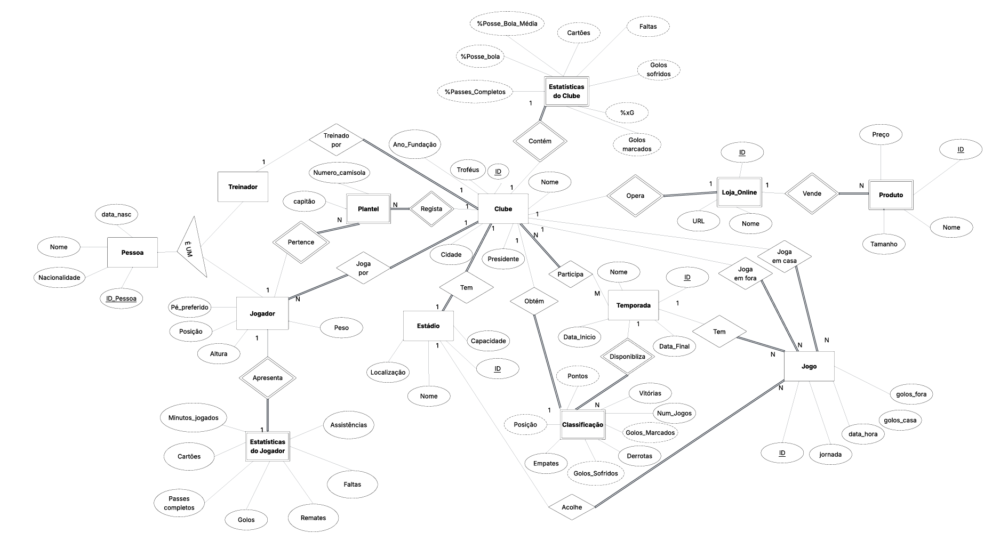

# BD: Trabalho Prático APFE

**Grupo**: P3G12
- Francisco Santos, MEC: 126255
- João Inventado, MEC: 2000

## Introdução / Introduction
O nosso projeto consiste no desenvolvimento de uma base de dados que permitirá acompanhar as temporadas da Liga Portugal. A aplicação disponibilizará informações sobre equipas, jogadores, resultados e classificações, bem como a merch das maiores equipas. 
O principal objetivo é centralizar dados da Liga Portugal, atuais e históricos, numa única plataforma organizada e acessível.

## ​Análise de Requi\sitos / Requirements

### Objetivo geral

Criar uma base de dados para armazenar e consultar dados da Liga Portugal, incluindo temporadas, equipas, jogadores e jogos.

### Requesitos funcionais
- Permitir visualizar a classificação geral de uma temporada.
- Consultar dados de uma equipa (nome, cidade, estádio, treinador).
- Consultar lista de jogadores de uma equipa.
- Ver resultados de jogos e estatísticas básicas.
- Consultar produtos de merchandising de cada equipa.

### Requisitos não funcionais
- A base de dados deve ser relacional.
- A informação deve estar normalizada até à 3ª forma normal.
- A aplicação deve permitir inserções e consultas rápidas.

### Entidades identificadas
- Equipa
- Plantel (11 inicial)
- Jogador
- Jogo
- Temporada
- Classificação
- Loja
- Estádio
- Treinador
- Estatísticas de equipa
- Estatísticas de jogador
- Pessoa

### Principais relações
- Uma equipa participa em várias temporadas (via classificação)
- Uma equipa tem vários jogadores e um treinador associado.
- Um jogo envolve duas equipas e pertence a uma temporada.
- Os três grandes têm merchandising associado (pode ser implementado nas outras equipas também).
- Cada equipa está localizada num estádio onde são realizados jogos em casa e fora de casa.
- Os jogadores e equipas têm estatísticas associadas
- Cada plantel pertence a uma equipa e temporada e é composta por vários jogadores
- Treinador e jogador são tipos de pessoa

## DER

## ER

